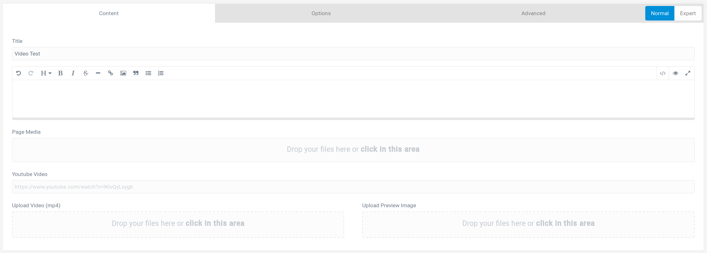

##### Table of Contents:

* [About](#about)
* [Features](#features)
* [Installation and Updates](#installation-and-updates)
* [Configuration](#Configuration)
* [Usage](#usage)
* [TO-DO](#to-do)
* [Contributing and Feedback](#contributing-and-feedback)
* [License](#license)

## About

`Video-Form` is an simple plugin for [GetGrav.org](http://getgrav.org) used to add a Youtube or mp4 video into your site.
This plugin is my first Grav plugin. I coded it to train myself in Grav. Use at own risk!

## Features

- Add an Youtube Video (Url)
- Upload an mp4 Video and an preview image

## Installation and Updates

## Configuration

## Usage

## TO-DO

- [ ] Add Vimeo

## Contributing and Feedback

## License

